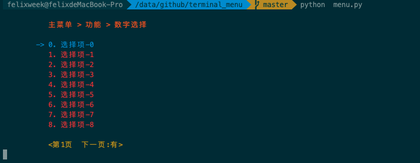
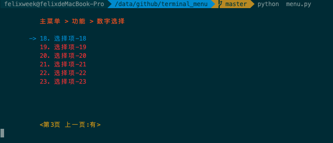
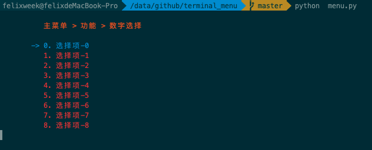
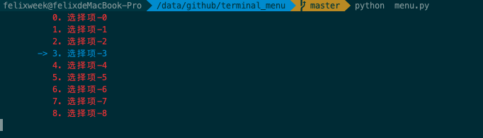

# terminal_menu

## terminal_menu  

一个快速创建命令行菜单的工具, fork:[tty_menu](https://github.com/gojuukaze/tty_menu) 

## 截图
1. 基本样式

   
  
  

2. 无页脚
  

3. 无标题无页脚
  

## Example

```
from menu import Menu
l = list(range(0, 24))
m = Menu(clear_screen=False) 
m.menu_style(page_size=10)
pos, value = m.tty_menu(l, title=["功能", "数字选择"])
print(pos, value)
```