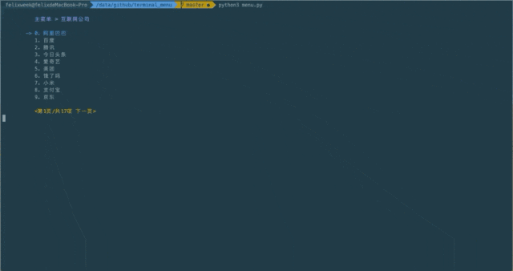

# terminal_menu

## terminal_menu  

一个快速创建命令行菜单的工具, fork:[tty_menu](https://github.com/gojuukaze/tty_menu) 
 


## Example  
```
    test_data = ["阿里巴巴", "百度", "腾讯", "今日头条", "爱奇艺", "美团", "饿了吗", "小米",
                 "支付宝", "京东", "拼多多", "微博", "携程", "网易", "哔哩哔哩", "迅雷", "360"]
    m = Menu()
    m.menu_style(page_size=10)
    pos = m.menu(test_data, title="互联网公司")
    print("Your word is ", pos)
```


## 快捷键

name | 111 | 222
:-: | :-: | :-:
方向键上/k | Up | 上移
方向键下/j | Down | 下移
方向键左/h | Next page | 上一页
方向键右/l | Prev page | 下一页
enter | Enter | 确认
b | Back | 返回 

